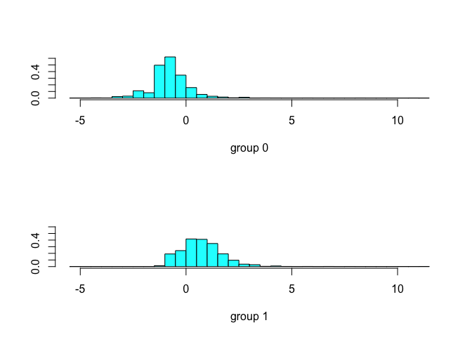
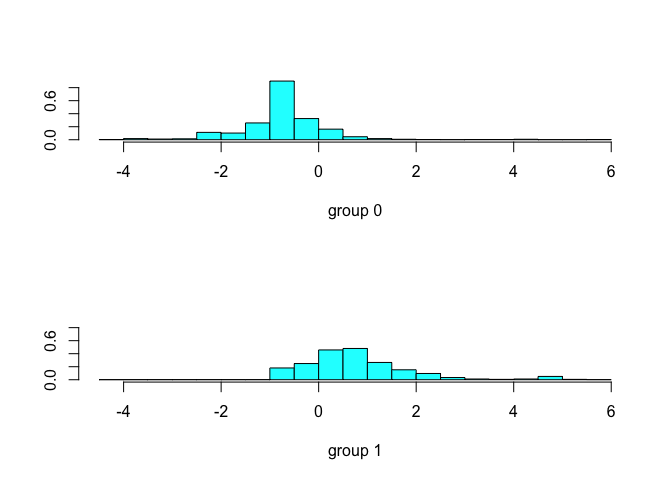
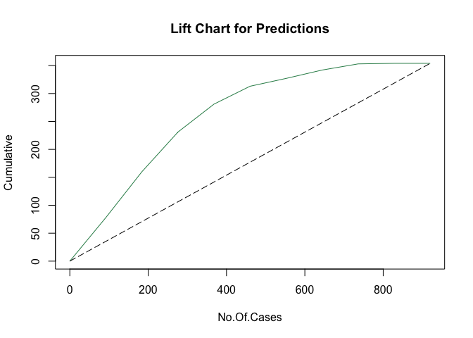
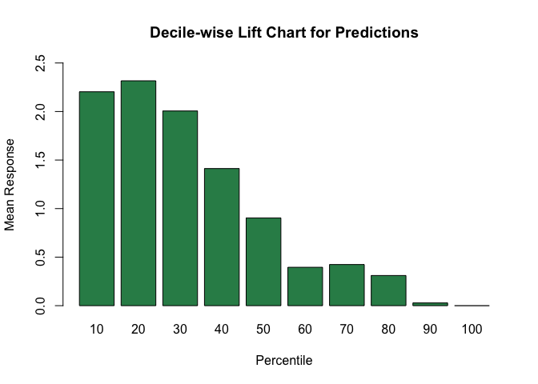

Classification of messages into Spam and Non-Spam. The data can be found at https://archive.ics.uci.edu/ml/datasets/Spambase
================
Manoj Bhandari

# Classification of E-Mail messages into spam and non-spam using LDA

-----

Load the required packages to workspace

``` r
if(!require("pacman")) install.packages("pacman")
pacman::p_load(data.table, MASS, caret, ggplot2, dplyr, gains)
```

## Read the dataset of e-mail messages which will be used for classification into spam and non-spam.

``` r
#Read the spambase.data file
e.data <- fread("spambase.data")
email.data <- data.frame(e.data)

#Read the spambase.names file
e.names <- read.csv("spambase.names", sep=":", header = FALSE, skip =33)
e.names.mat <- as.matrix(e.names[-2])

#Rename the column names of spambase.data file
colnames(email.data) <- c(e.names.mat,"Spam/Non-Spam")
```

## Partition the data into Training and Validation sets and normalize them.

``` r
#Set seed
set.seed(42)

#Generate training indices
train.indices <- createDataPartition(email.data$`Spam/Non-Spam`, p = 0.8, list = FALSE)
#Get the training data
training <- email.data[train.indices, ]
#Get the validation data
validation <- email.data[-train.indices, ]

#Normalize the data to be used in LDA
email.normalized <- preProcess(training[,1:57], method = c("center","scale"))
email.train <- predict(email.normalized, training)
email.validation <- predict(email.normalized, validation)
```

-----

## Let’s examine how each predictor differs between the spam and non-spam e-mails by comparing the spam-class average and non-spam-class average. Identify 10 predictors for which the difference between the spam-class average and non- spam class average is highest.

``` r
#Get rows where Spam/Non-Spam = 1(Spam)
spam.class <- email.data %>% filter(email.data$`Spam/Non-Spam` == 1)
#Get rows where Spam/Non-Spam(Spam) = 0(Non-Spam)
non.spam.class <- email.data %>% filter(email.data$`Spam/Non-Spam` == 0)

#Find the column means of Spam class
avg.spam <- colMeans(spam.class[,1:57])
#Find the column means of Non-Spam class
avg.nonspam <- colMeans(non.spam.class[,1:57])

#Find the absolute difference between values of spam and non-spam class
pred.diff <- abs(avg.spam - avg.nonspam)
#Load the mean difference values into a vector
pred.vec <- as.vector(pred.diff)
#Get the column names of the difference values stored in vector
names(pred.vec) <- names(pred.diff)

#Get the top 10 predictors with highest difference in mean values
top.ten <- head(sort(pred.vec, decreasing = TRUE), 10)
#Get the names of the top ten predictors and load it into a dataframe
top.ten.names <- as.data.frame(names(top.ten))

#Print the top ten predictor values
colnames(top.ten.names) <- c("The top ten predictors")
top.ten.names
```

    ##        The top ten predictors
    ## 1    capital_run_length_total
    ## 2  capital_run_length_longest
    ## 3  capital_run_length_average
    ## 4            word_freq_george
    ## 5               word_freq_you
    ## 6              word_freq_your
    ## 7                word_freq_hp
    ## 8              word_freq_free
    ## 9               word_freq_hpl
    ## 10                char_freq_!

-----

## Perform a linear discriminant analysis using the training dataset. Include only 10 predictors identified in the question above in the model.

``` r
#Store the top ten predictors in a variable
col1 <- names(top.ten)
cols <- c(col1,'Spam/Non-Spam')
#Get the data from normalized training dataset having only top ten predictors
pred.data.train <- email.train[, cols]
pred.data.valid <- email.validation[, cols]

#Apply the LDA on the normalized training data having top ten predictors
lda.model <- lda( `Spam/Non-Spam`~. , data = pred.data.train)
```

-----

## Let is examine the prior probabilities.

``` r
#Get the prior probabilities and print them
prior.probablities <- lda.model$prior
prior.probablities
```

    ##         0         1 
    ## 0.6036403 0.3963597

-----

### The coefficients of linear discriminants are partial contributors of the equation for discriminant function. These multiplied by respective predictor variable calculate the LDA score.

### Given below are the co-efficients for the spambase data

``` r
lda.model$scaling
```

    ##                                    LD1
    ## capital_run_length_total    0.41440081
    ## capital_run_length_longest  0.08693844
    ## capital_run_length_average  0.06514596
    ## word_freq_george           -0.20131729
    ## word_freq_you               0.22218685
    ## word_freq_your              0.55570537
    ## word_freq_hp               -0.23537035
    ## word_freq_free              0.43382365
    ## word_freq_hpl              -0.16541775
    ## `char_freq_!`               0.29626807

-----

## Let us generate linear discriminants using your analysis and see how are they used in classifying spams and non-spams.

``` r
#Predictions on validation dataset
predictions <- predict(lda.model, pred.data.valid)
top.20.preds <- head(predictions$posterior,20)
top.20.preds
```

    ##              0         1
    ## 5   0.64589615 0.3541039
    ## 11  0.57889670 0.4211033
    ## 21  0.82402312 0.1759769
    ## 28  0.74794028 0.2520597
    ## 40  0.40363019 0.5963698
    ## 42  0.32500406 0.6749959
    ## 76  0.08740194 0.9125981
    ## 85  0.79762191 0.2023781
    ## 88  0.31855452 0.6814455
    ## 90  0.86896577 0.1310342
    ## 107 0.74554090 0.2544591
    ## 117 0.60832931 0.3916707
    ## 120 0.22220720 0.7777928
    ## 123 0.05146256 0.9485374
    ## 128 0.45099510 0.5490049
    ## 129 0.34035938 0.6596406
    ## 133 0.46140590 0.5385941
    ## 136 0.41066757 0.5893324
    ## 137 0.41066757 0.5893324
    ## 145 0.09008854 0.9099115

### The LDA score from the equation are converted into probabilities of belonging to a class. The probability value is compared to either pre-defined value (50/50) or a modified value and then that record is classified. For eg., In the first instance of the output of the code below, 0.6459 \> 0.354 hence the email will be classified as non-spam.

-----

### There is one linear discriminant in the model. Since there are only two categories in the model: Spam and non-spam; one linear discriminant is enough for classification.

-----

## Let us generate LDA plot using the training and validation data to examine what information is presented in these plots and how are they different.

``` r
#Predictions for training data
train.preds <- lda(`Spam/Non-Spam`~. , data = pred.data.train)
#Plot training data predictions
plot(train.preds)
```

<!-- -->

``` r
#Predictions for validation data
valid.preds <- lda(`Spam/Non-Spam`~. , data = pred.data.valid)
#Plot validation data predictions
plot(valid.preds)
```

<!-- -->

## From both training data and validation data we observe that for Non-Spam, most of the values are towards the left 0 while for spam, most of the values are towards the right 0. Hence our LDA has maximised the separatibility between the two classes.

-----

## Let us generate the relevant confusion matrix to examine various metrics?

### As observed from the results below, the Sensitivity is *0.911* and Specificity is *0.671*

``` r
Conf.mat<- table(predictions$class, pred.data.valid$`Spam/Non-Spam`)
confusionMatrix(Conf.mat)
```

    ## Confusion Matrix and Statistics
    ## 
    ##    
    ##       0   1
    ##   0 520 118
    ##   1  46 236
    ##                                          
    ##                Accuracy : 0.8217         
    ##                  95% CI : (0.7954, 0.846)
    ##     No Information Rate : 0.6152         
    ##     P-Value [Acc > NIR] : < 2.2e-16      
    ##                                          
    ##                   Kappa : 0.6086         
    ##                                          
    ##  Mcnemar's Test P-Value : 2.954e-08      
    ##                                          
    ##             Sensitivity : 0.9187         
    ##             Specificity : 0.6667         
    ##          Pos Pred Value : 0.8150         
    ##          Neg Pred Value : 0.8369         
    ##              Prevalence : 0.6152         
    ##          Detection Rate : 0.5652         
    ##    Detection Prevalence : 0.6935         
    ##       Balanced Accuracy : 0.7927         
    ##                                          
    ##        'Positive' Class : 0              
    ## 

-----

## Let’s generate lift and decile charts for the validation dataset and evaluate the effectiveness of the model in identifying spams.

``` r
#Plot the Lift Chart
gain.data <- gains(as.numeric(pred.data.valid$`Spam/Non-Spam`),predictions$x[,1])
plot(c(0,gain.data$cume.pct.of.total*sum(as.numeric(pred.data.valid$`Spam/Non-Spam`)))
     ~c(0,gain.data$cume.obs),
     xlab = 'No.Of.Cases', ylab = 'Cumulative',
     main = "Lift Chart for Predictions",
     col = "seagreen",
     type = "l")
lines(c(0,sum(as.numeric(pred.data.valid$`Spam/Non-Spam`)))~c(0,dim(email.validation)[1]), lty = 5)
```

<!-- -->

``` r
#Plot the Decile Lift Chart
heights.data <- gain.data$mean.resp/mean(as.numeric(pred.data.valid$`Spam/Non-Spam`))
barplot(heights.data, names.arg = gain.data$depth,
        ylim = c(0,2.5),
        col = "seagreen",
        xlab = "Percentile",
        ylab = "Mean Response",
        main = "Decile-wise Lift Chart for Predictions")
```

<!-- -->
\#\#\# From above lift chart, we observe that our model is performing
pretty well when compared to naive benchmark. For eg., if we choose top
400 records, our model predicts it correctly for about 300 of them as
compared to 150 in random
assignment

### From the Decile chart we can see that if we select top 30% of the records with highest propensities we will still be performing twice as better than random assignment.

-----

## Let us check if accuracy of model changes if I use a probability threshold of 0.2

``` r
confusionMatrix(as.factor(ifelse(predictions$x>0.2, 1, 0)), predictions$class)
```

    ## Confusion Matrix and Statistics
    ## 
    ##           Reference
    ## Prediction   0   1
    ##          0 592   0
    ##          1  46 282
    ##                                           
    ##                Accuracy : 0.95            
    ##                  95% CI : (0.9339, 0.9632)
    ##     No Information Rate : 0.6935          
    ##     P-Value [Acc > NIR] : < 2.2e-16       
    ##                                           
    ##                   Kappa : 0.8875          
    ##                                           
    ##  Mcnemar's Test P-Value : 3.247e-11       
    ##                                           
    ##             Sensitivity : 0.9279          
    ##             Specificity : 1.0000          
    ##          Pos Pred Value : 1.0000          
    ##          Neg Pred Value : 0.8598          
    ##              Prevalence : 0.6935          
    ##          Detection Rate : 0.6435          
    ##    Detection Prevalence : 0.6435          
    ##       Balanced Accuracy : 0.9639          
    ##                                           
    ##        'Positive' Class : 0               
    ## 

### From the above confusion matrix we can see that the accuracy of the model has increased if we use the probability threashold of 0.2.
